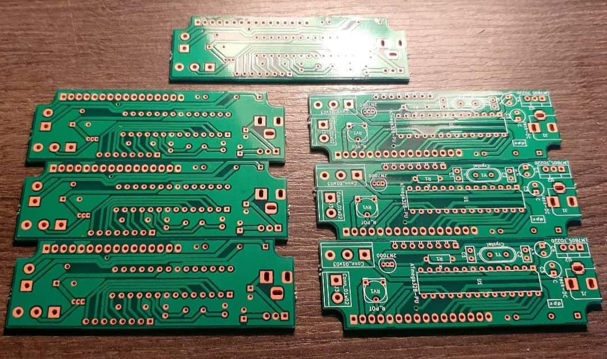
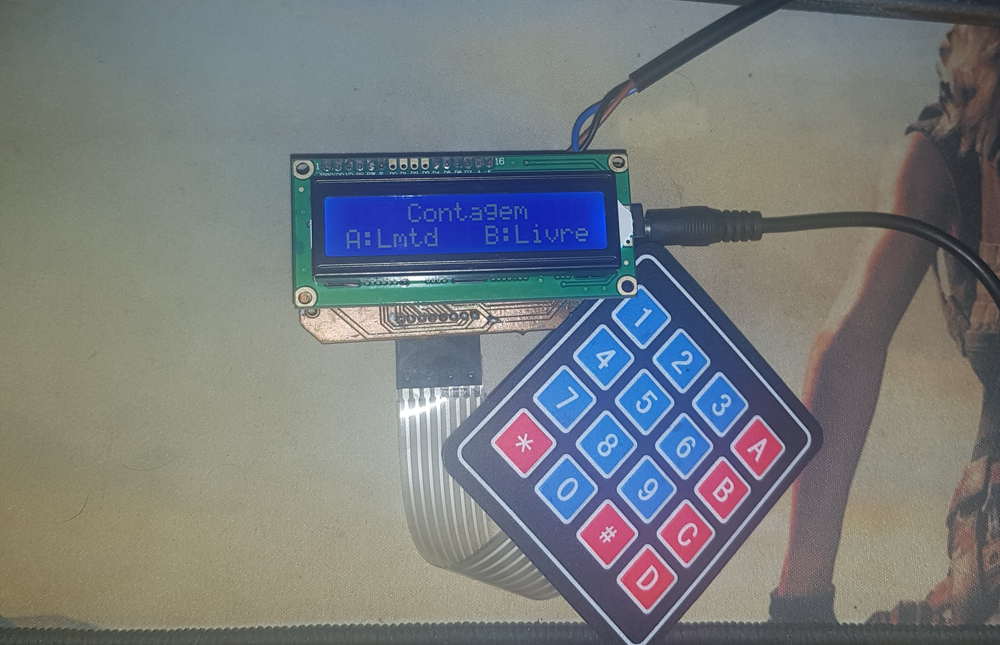
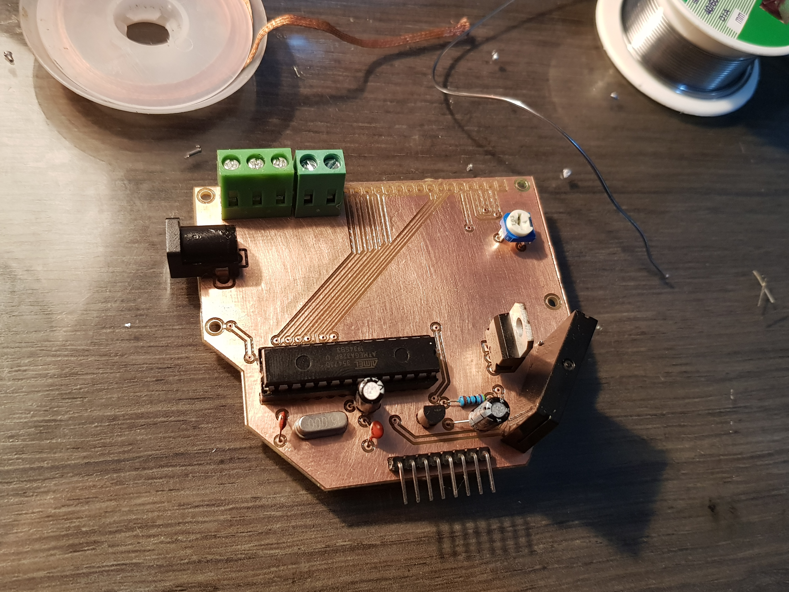

# Contdor de garrafões
 Contador de garrafoes e controlador de esteira industrial.

## Requisitos:
- Arduino_FreeRTOS.h
- Bounce2.h
- Keypad.h
- LiquidCrystal.h

## Imagens
### 3º layout

### 2º layout

### 1º layout

### 1º montagem em protoboard

